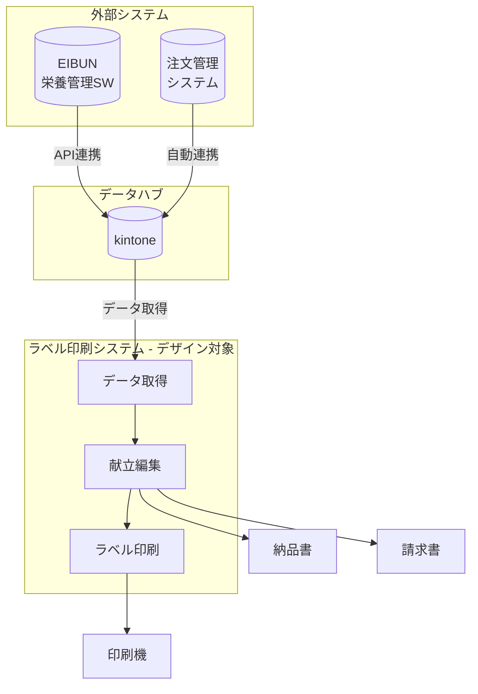

# ラベル印刷システム UIデザイン要件書

## 1. プロジェクト概要

### 1.1 システム名
ラベル印刷システム（リニューアル版）

### 1.2 目的
給食製造業向けのラベル印刷システムのUI/UXリニューアル。
現行システム（Windows Forms風）をモダンなWebアプリケーションUIに刷新する。

### 1.3 ユーザー
- 栄養士・製造担当者（非ITエンジニア）
- 毎日使用する業務システム（1日2〜3時間）
- 年齢層: 30〜50代

---

## 2. 現行システム画面

### 2.1 画面一覧

| 画面名 | 役割 |
|-------|------|
| ラベル印刷一覧 | 製造日ごとの全施設・全献立を一覧表示。印刷対象を選択 |
| 献立表（詳細編集） | 施設ごとの献立・禁食・数量を設定 |
| 印刷プレビュー | 印刷前の最終確認・微調整 |

### 2.2 現行画面スクリーンショット

`screenshots/` フォルダ内に現行画面の画像を格納:

| ファイル名 | 内容 |
|-----------|------|
| `01_asis_label-list.png` | 現行: ラベル印刷一覧画面 |
| `02_asis_menu-detail.png` | 現行: 献立表（詳細編集）画面 |
| `03_asis_print-preview.png` | 現行: 印刷プレビュー画面 |

---

## 3. 業務フロー（To-Be）

### 3.1 全体の流れ

**ポイント: 注文数・栄養データはkintoneから自動取得**

### 3.2 操作フロー（シンプル化）

1. **施設を選択** - 一覧から印刷対象を選ぶ
2. **数量を確認** - kintoneから自動反映済み
3. **禁食対応**（必要な場合のみ）- モーダルで選択
4. **印刷実行** - ラベルを印刷

※ 現行の「数出し」作業は不要（自動化）

---

## 4. 画面設計要件（To-Be）

### 4.1 ラベル印刷一覧画面

**コンセプト**: シンプルな2ペイン構成

**レイアウト**:
- 左: 一覧テーブル（必要最小限のカラム）
- 右: 詳細パネル（選択した項目の情報 + ラベルプレビュー）

**表示項目（テーブル）**:
| 項目 | 説明 |
|-----|------|
| ☑️ | チェックボックス |
| 施設名 | 届け先名 |
| 献立名 | メニュー名 |
| 数量 | 注文数 |
| 区分 | 朝/昼/夕 |

**操作**:
- チェックボックスで複数選択
- フィルター（施設、区分、状態）
- インクリメンタルサーチ

### 4.2 献立表画面

**コンセプト**: 2カラム + モーダル構成（3カラムから簡略化）

**レイアウト**:
- 左: 施設の献立リスト（朝昼夜タブ切り替え）
- 右: 注文数・治療食設定（kintoneから自動取得）

**モーダル**:
- 禁食対応選択（必要なときだけ開く）
- 追加献立登録（特別メニュー）

**操作**:
- 施設プルダウンで切り替え
- 数量は直接編集
- 禁食追加はモーダルで完結

### 4.3 印刷プレビュー（モーダル）

**目的**: 印刷前の最終確認・微調整

**表示項目**:
- ラベルのプレビュー画像
- 成分表示（編集可能）
- 保存方法（変更可能: チル/冷凍/常温）
- 印刷部数

---

## 5. UI/UX改善ポイント

### 5.1 現行システムの課題

| 課題 | 影響 |
|-----|------|
| Shift+クリックでの複数選択 | わかりにくい、操作ミス |
| 3カラム画面が情報過多 | 視線移動が多く疲れる |
| エラー時のフィードバックがない | 何が問題かわからない |
| 入数0の献立が表示される | 印刷ミスの原因 |

### 5.2 改善要望

| Before | After |
|--------|-------|
| Shift+クリック | チェックボックスで明示的に選択 |
| 3カラム常時表示 | 2カラム + モーダル |
| フィードバックなし | 成功/警告/エラーの通知 |
| 入数0も表示 | 非表示 or グレーアウト |

### 5.3 UX要件

- **フィードバック**: 操作結果を必ず通知
- **エラー防止**: 確認ダイアログ、入力バリデーション
- **キーボードショートカット**: 熟練者向け対応
- **アクセシビリティ**: 色覚対応、コントラスト確保

---

## 6. 技術スタック（参考）

| 項目 | 技術 |
|-----|------|
| フロントエンド | React + TypeScript |
| UIフレームワーク | 未定（デザインに合わせて選定） |
| データ連携 | kintone API |
| 印刷 | ブラウザ印刷 or 専用ライブラリ |

---

## 7. 納品物

- [ ] Figmaデザインファイル
- [ ] 画面デザイン（2画面 + モーダル3個）
- [ ] コンポーネント一覧
- [ ] カラーパレット・タイポグラフィ

---

## 8. スケジュール（参考）

| フェーズ | 内容 |
|--------|------|
| 1 | ヒアリング・要件確認 |
| 2 | ワイヤーフレーム作成 |
| 3 | デザインカンプ作成 |
| 4 | フィードバック・修正 |
| 5 | 納品 |

