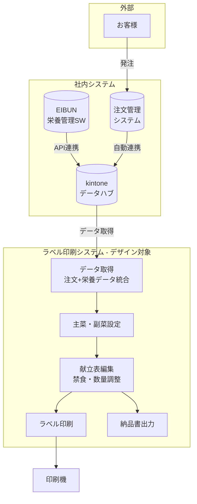
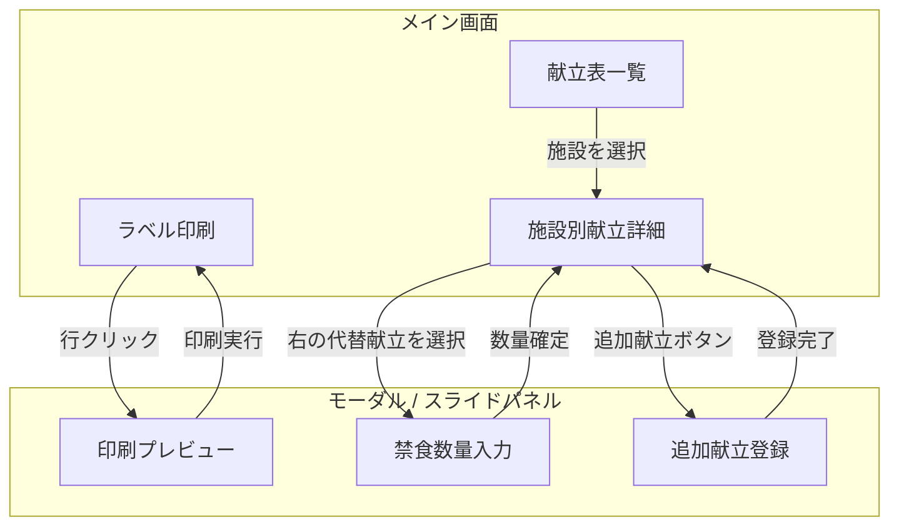
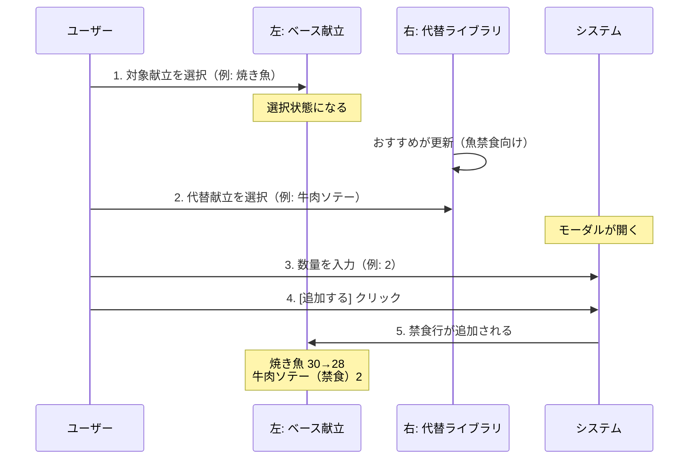

# レイアウト提案書

## システム全体フロー



---

## 画面遷移図



---

## 画面1: ラベル印刷

### コンセプト

- **シンプルな2ペイン構成**
- 左: 一覧テーブル（**食品でグループ化**、展開/折りたたみ可能）
- 右: 詳細パネル（選択した**業者**の情報）

**ポイント:**

- 同じ食品でも業者ごとに別々に袋詰め・ラベル印刷する
- MAX入数、保存方法、加工区分は**業者ごと**に異なる

### レイアウト構成

```
┌─────────────────────────────────────────────────────────────────────────┐
│  🏠 ラベル印刷      📅 喫食日: [2024/12/10 ▼]               [⚙ 設定]  │
├─────────────────────────────────────────────────────────────────────────┤
│  🔍 [検索...]  [施設 ▼] [区分 ▼]                          [クリア]     │
├───────────────────────────────────────────────────┬─────────────────────┤
│              左: 一覧テーブル 70%                 │ 右: 詳細パネル 30%  │
│                                                   │                     │
│  ┌────────────────────────────────────────────────────────────────────┐│ 施設名: A病院 │
│  │    │  │ 食品名/業者名          │ 数量 │ 区分 │製造日│MAX│加工   ││ 献立名: じゃが│
│  ├────────────────────────────────────────────────────────────────────┤│   芋のカレー  │
│  │ ☑ │▼│ じゃが芋のカレー (150)                              計3200  ││               │
│  │   │  │  ☑ A病院     │ 23 │ 🌅朝 │ 12/10 │ 50 │ チル            ││ ┌───────────┐│
│  │   │  │  ☑ B介護施設 │ 30 │ 🌅朝 │ 12/09 │ 30 │ 冷凍            ││ │ラベル     ││
│  │   │  │  ☑ C病院     │ 15 │ 🌅朝 │ 12/10 │ 50 │ チル            ││ │プレビュー ││
│  │   │  │  ...（150施設）                                            ││ │           ││
│  ├────────────────────────────────────────────────────────────────────┤│ └───────────┘│
│  │ ☐ │▶│ 味噌汁 (150)                                        計2800  ││               │
│  ├────────────────────────────────────────────────────────────────────┤│               │
│  │ ☐ │▶│ キャベツのごま和え (148)                            計2500  ││               │
│  └────────────────────────────────────────────────────────────────────┘│               │
│                                                            ↓scroll    │               │
├───────────────────────────────────────────────────┴─────────────────────┤
│  ☑ 150件選択中（じゃが芋のカレー）              [🖨️ 選択分を印刷]     │
└─────────────────────────────────────────────────────────────────────────┘
```

### 選択の仕組み（重要）

#### 業務オペレーション

```
同じ食品を作る → 袋詰め → その食品のラベルを印刷
```

**つまり:**

- 「じゃが芋のカレー」を150施設分作る → 袋詰め → じゃが芋のカレーのラベルを印刷
- 次に「味噌汁」を150施設分作る → 袋詰め → 味噌汁のラベルを印刷

#### UI構成

| UI要素              | 機能                                     |
| ------------------- | ---------------------------------------- |
| **食品名行 ☑**     | その食品の**全業者を選択**               |
| **展開ボタン ▶/▼** | 業者一覧を展開/折りたたみ（150業者対応） |
| **業者行 ☑**       | 個別業者のON/OFF                         |

#### チェックボックスの動作

| 操作          | 結果                                      |
| ------------- | ----------------------------------------- |
| 食品名☑をON  | その食品の150業者すべてにチェックが入る   |
| 食品名☑をOFF | その食品の150業者すべてのチェックが外れる |
| 業者☑        | その業者だけON/OFF                        |
| 一部だけ選択  | 食品名☑は「−」（中間状態）になる         |

### サンプルデータ

| ☑  | 展開 | 食品名/業者名                | 数量   | 区分  | 製造日 | MAX入数 | 加工 |
| --- | ---- | ---------------------------- | ------ | ----- | ------ | ------- | ---- |
| ☑  | ▼    | **じゃが芋のカレー (150)**   | 計3200 |       |        |         |      |
|     |      | ☑ A病院                     | 23     | 🌅 朝 | 12/10  | 50      | チル |
|     |      | ☑ B介護施設                 | 30     | 🌅 朝 | 12/09  | 30      | 冷凍 |
|     |      | ☑ C病院                     | 15     | 🌅 朝 | 12/10  | 50      | チル |
|     |      | ...（150施設）               |        |       |        |         |      |
| ☐   | ▶   | **味噌汁 (150)**             | 計2800 |       |        |         |      |
| ☐   | ▶   | **キャベツのごま和え (148)** | 計2500 |       |        |         |      |

### 詳細パネル表示項目

**業者行を選択した時に表示**

| 項目             | 内容例               | 備考         |
| ---------------- | -------------------- | ------------ |
| 施設名           | A病院                |              |
| 献立名           | じゃが芋のカレー炒め |              |
| ラベルプレビュー | (画像表示)           |              |
| 製造日           | 12/10                | **業者ごと** |
| MAX入数          | 50                   | **業者ごと** |
| 加工区分         | チル / 冷凍          | **業者ごと** |

### テーブルカラム（業者行）

| カラム           | 備考                     |
| ---------------- | ------------------------ |
| ☑ チェック      |                          |
| 業者名           |                          |
| 数量             |                          |
| 区分（朝/昼/夕） |                          |
| 製造日           | **業者ごと**             |
| MAX入数          | **業者ごと**             |
| 加工区分         | チル / 冷凍 **業者ごと** |

### UI要素

| 要素             | 仕様                               |
| ---------------- | ---------------------------------- |
| チェックボックス | 個別選択、ヘッダーで全選択         |
| フィルター       | ドロップダウン（施設、区分、状態） |
| 検索             | インクリメンタルサーチ             |
| 詳細パネル       | 選択行の詳細 + ラベルプレビュー    |

---

## 画面2: 献立表一覧

### コンセプト

- **施設×献立のデータグリッド**
- 全施設・全献立を一覧表示
- MAX入数、注文数の確認
- 主菜/副菜の設定が可能
- 施設名クリックで施設別献立詳細画面に遷移

### レイアウト構成

```
┌─────────────────────────────────────────────────────────────────────────┐
│  🏠 献立表一覧      📅 喫食日: [2024/12/10 ▼]               [⚙ 設定]  │
├─────────────────────────────────────────────────────────────────────────┤
│  🔍 [検索...]  [施設 ▼] [区分 ▼]                          [クリア]     │
├─────────────────────────────────────────────────────────────────────────┤
│                                                                         │
│  施設名        │ 献立名              │ 注文数 │ MAX │ 主/副           │
│ ───────────────┼─────────────────────┼────────┼─────┼──────────────── │
│  A病院         │ じゃが芋のカレー    │   23   │  50 │ [主菜 ▼]        │
│  A病院         │ キャベツのごま和え  │   23   │  30 │ [副菜 ▼]        │
│  B介護施設     │ じゃが芋のカレー    │   30   │  50 │ [主菜 ▼]        │
│  B介護施設     │ 味噌汁              │   30   │  40 │ [副菜 ▼]        │
│  C病院         │ 焼き魚              │   15   │  50 │ [主菜 ▼]        │
│  C病院         │ ほうれん草和え      │   15   │  30 │ [副菜 ▼]        │
│  ...                                                           scroll  │
├─────────────────────────────────────────────────────────────────────────┤
│  150件表示中                                                            │
└─────────────────────────────────────────────────────────────────────────┘
```

### テーブルカラム

| カラム   | 備考                               |
| -------- | ---------------------------------- |
| 施設名   | クリックで詳細画面へ遷移           |
| 献立名   | 施設に紐づく献立                   |
| 注文数   | 注文管理システムから自動連携       |
| MAX      | MAX入数（編集可能）                |
| 主/副    | 主菜/副菜の設定（ドロップダウン）  |

---

## 画面3: 施設別献立詳細（2カラム + モーダル）

### コンセプト

- **2カラム構成**（3カラムから簡略化）
- 左: ベース献立（EIBUNから取得）
- 右: 代替献立ライブラリ（禁食時の差し替え元）
- 朝食/昼食/夕食を**縦にスクロール表示**（タブ切り替えなし）
- 注文数・禁食情報を**上部に常時表示**
- **即座保存（オートセーブ）**: 変更時に自動保存、ヘッダーにステータス表示

### レイアウト構成

```
┌─────────────────────────────────────────────────────────────────────────┐
│  ← 戻る          施設選択: [A病院 ▼]                   ✓ 保存しました  │
├─────────────────────────────────────────────────────────────────────────┤
│  📦 注文数: 30名    🚫 禁食: 魚2名 / 卵1名 / 乳製品0名                  │
├─────────────────────────────────────────────┬───────────────────────────┤
│          左: ベース献立（EIBUN）            │   右: 代替献立ライブラリ  │
│                  60%                        │           40%             │
│                                             │                           │
│  🌅 朝食 ─────────────────────────          │  🔍 [献立を検索...]       │
│  ┌─────────────────────────────────┐        │                           │
│  │ ☐ 主菜: 焼き魚            28   │←選択   │  💡 おすすめ（魚禁食向け）│
│  │ ☐ 副菜: ほうれん草和え    30   │        │  ├─ 牛肉ソテー            │
│  │ 🚫 魚禁食→牛肉ソテー      2    │        │  ├─ 豚の生姜焼き          │
│  └─────────────────────────────────┘        │  └─ 鶏の照り焼き          │
│                                             │                           │
│  ☀ 昼食 ─────────────────────────          │  📋 全献立                │
│  ┌─────────────────────────────────┐        │  ├─ ハンバーグ            │
│  │ ☐ 主菜: カレーライス      30   │        │  ├─ オムレツ              │
│  │ ☐ 副菜: サラダ            30   │        │  ├─ 肉じゃが              │
│  └─────────────────────────────────┘        │  ├─ 唐揚げ                │
│                                             │  └─ ...                   │
│  🌙 夕食 ─────────────────────────          │                           │
│  ┌─────────────────────────────────┐        │                           │
│  │ ☐ 主菜: 煮物              30   │        │                           │
│  │ ☐ 副菜: 味噌汁            30   │        │                           │
│  └─────────────────────────────────┘        │                           │
│                                             │                           │
│  [+ 禁食追加]  [+ 追加献立]                 │                           │
│                                    ↓scroll  │                           │
├─────────────────────────────────────────────┴───────────────────────────┤
│  次の施設: B介護施設                                        [→ 次へ]   │
└─────────────────────────────────────────────────────────────────────────┘
```

### 施設情報バー

上部に常時表示。注文数と禁食情報を一目で確認。

| 項目     | 表示例                             |
| -------- | ---------------------------------- |
| 注文数   | 📦 注文数: 30名                    |
| 禁食情報 | 🚫 禁食: 魚2名 / 卵1名 / 乳製品0名 |

### 左カラム: ベース献立（EIBUN）

EIBUNから出力された献立 × 数量。朝食→昼食→夕食の順に縦スクロール。

**サンプル: A病院（注文数30名、魚禁食2名）**

| 区分        | 献立名                    | 数量 | 操作   |
| ----------- | ------------------------- | ---- | ------ |
| **🌅 朝食** |                           |      |        |
| ☐ 主菜      | 焼き魚                    | 28   | [選択] |
| ☐ 副菜      | ほうれん草和え            | 30   |        |
| 🚫 禁食     | 魚禁食→牛肉ソテー         | 2    | [削除] |
| **☀ 昼食** |                           |      |        |
| ☐ 主菜      | カレーライス              | 30   | [選択] |
| ☐ 副菜      | サラダ                    | 30   |        |
| **🌙 夕食** |                           |      |        |
| ☐ 主菜      | 煮物                      | 30   | [選択] |
|             | [+ 禁食追加] [+ 追加献立] |      |        |

※ 禁食追加時は、まず**左で対象献立を選択**してから右の代替献立を選ぶ

### 右カラム: 代替献立ライブラリ

禁食時の差し替え元。検索・おすすめ表示あり。

| セクション      | 内容                         |
| --------------- | ---------------------------- |
| 🔍 検索ボックス | インクリメンタルサーチ       |
| 💡 おすすめ     | 選択中の禁食に関連する献立   |
| 📋 全献立       | 登録されている全ての代替献立 |

### 禁食追加の操作フロー



### 2カラムの役割

| カラム                     | 内容                                    |
| -------------------------- | --------------------------------------- |
| **左: ベース献立**         | EIBUN出力、朝昼夕を縦表示、禁食の適用先 |
| **右: 代替献立ライブラリ** | 禁食時の差し替え元、検索・おすすめ機能  |

---

## モーダル1: 禁食数量入力

### コンセプト

- 左で対象献立、右で代替献立を選択した後に開く
- 数量を入力して確定するだけのシンプルなモーダル

### レイアウト構成

```
┌────────────────────────────────────────┐
│  🚫 禁食を追加                      ✕  │
├────────────────────────────────────────┤
│                                        │
│  対象献立: 焼き魚                      │
│                                        │
│  代替献立: 牛肉ソテー                  │
│                                        │
│  数量: [  2  ]                         │
│                                        │
│  ※ 焼き魚の数量が 30→28 に減ります    │
│                                        │
├────────────────────────────────────────┤
│       [キャンセル]    [✔ 追加する]     │
└────────────────────────────────────────┘
```

### 表示項目

| 項目     | 内容                               |
| -------- | ---------------------------------- |
| 対象献立 | 左で選択した献立（例: 焼き魚）     |
| 代替献立 | 右で選択した献立（例: 牛肉ソテー） |
| 数量     | 禁食対象の人数（数値入力）         |
| 注記     | 元の献立の数量変化を表示           |

### ポイント

- **シンプル**: 数量入力だけに集中
- **わかりやすい**: 何がどう変わるか明示
- **ミス防止**: 元の数量の変化を表示

---

## モーダル2: 追加献立登録

### レイアウト構成

```
┌────────────────────────────────────────┐
│  ➕ 追加献立を登録                  ✕  │
├────────────────────────────────────────┤
│                                        │
│  献立名 *                              │
│  [味噌汁（具のみ）              ]      │
│                                        │
│  区分 *                                │
│  [汁物 ▼]                              │
│                                        │
│  数量 *                                │
│  [  5  ]                               │
│                                        │
│  備考（任意）                          │
│  [C病院様特別注文              ]       │
│                                        │
├────────────────────────────────────────┤
│       [キャンセル]    [✔ 登録する]     │
└────────────────────────────────────────┘
```

### 入力例

| 項目   | 入力値           |
| ------ | ---------------- |
| 献立名 | 味噌汁（具のみ） |
| 区分   | 汁物             |
| 数量   | 5                |
| 備考   | C病院様特別注文  |

### 用途

- 味噌汁の具だけ注文
- 米30キロ注文
- 特別メニューの追加

---

## モーダル3: 印刷プレビュー

### レイアウト構成

```
┌──────────────────────────────────────────────────────────────────┐
│  🖨 印刷プレビュー                                            ✕  │
├──────────────────────────────────────────────────────────────────┤
│                                                                  │
│  ┌─────────────────────┐    施設名: A病院                       │
│  │                     │    献立名: じゃが芋のカレー炒め        │
│  │    ┌──────────┐     │                                        │
│  │    │ ラベル   │     │    成分表示（編集可）                  │
│  │    │ プレビュー│     │    ┌────────────────────────────┐     │
│  │    │          │     │    │じゃが芋、豚肉、カレー粉、  │     │
│  │    │          │     │    │玉ねぎ、にんにく、塩...     │     │
│  │    └──────────┘     │    └────────────────────────────┘     │
│  │                     │                                        │
│  └─────────────────────┘    保存方法                            │
│        50%                  ● 要冷蔵  ○ 要冷凍  ○ 常温         │
│                                                                  │
│                             印刷部数: [ 23 ]                     │
│                                                                  │
│                             オプション                           │
│                             ☑ QRコード印刷                       │
│                             ☑ 喫食日印刷                         │
│                                                                  │
├──────────────────────────────────────────────────────────────────┤
│              [キャンセル]                   [🖨 印刷する]        │
└──────────────────────────────────────────────────────────────────┘
```

### 設定項目

| 項目       | 入力形式                 | サンプル値                                                         |
| ---------- | ------------------------ | ------------------------------------------------------------------ |
| 施設名     | 表示のみ                 | A病院                                                              |
| 献立名     | 表示のみ                 | じゃが芋のカレー炒め                                               |
| 成分表示   | テキストエリア（編集可） | じゃが芋、豚肉、カレー粉、玉ねぎ、にんにく、塩、こしょう、サラダ油 |
| 保存方法   | ラジオボタン             | ● 要冷蔵 ○ 要冷凍 ○ 常温                                           |
| 印刷部数   | 数値入力                 | 23                                                                 |
| オプション | チェックボックス         | ☑ QRコード印刷 / ☑ 喫食日印刷                                    |

※ MAX入数（50）を超える場合は自動分割

---

## デザイン方針

### カラーパレット（kintone参考）

| 用途         | カラー    | 使用箇所                 |
| ------------ | --------- | ------------------------ |
| プライマリ   | `#4A90D9` | ボタン、リンク、選択状態 |
| セカンダリ   | `#F5A623` | 警告、重要アクション     |
| 成功         | `#7ED321` | 完了、印刷済み           |
| エラー       | `#D0021B` | エラー、削除             |
| 背景         | `#F7F8FA` | ページ背景               |
| カード       | `#FFFFFF` | パネル、モーダル         |
| テキスト     | `#333333` | 本文                     |
| サブテキスト | `#888888` | ラベル、補足             |
| ボーダー     | `#E0E0E0` | 区切り線、枠線           |

### タイポグラフィ

| 用途    | サイズ | ウェイト |
| ------- | ------ | -------- |
| 見出し1 | 24px   | Bold     |
| 見出し2 | 18px   | SemiBold |
| 本文    | 14px   | Regular  |
| ラベル  | 12px   | Medium   |
| 補足    | 11px   | Regular  |

### コンポーネント

| コンポーネント       | 仕様                                        |
| -------------------- | ------------------------------------------- |
| ボタン（プライマリ） | 角丸 6px、高さ 40px、背景 #4A90D9           |
| ボタン（セカンダリ） | 角丸 6px、高さ 40px、枠線のみ               |
| 入力フィールド       | 角丸 4px、高さ 40px、フォーカス時に青枠     |
| カード               | 角丸 8px、shadow: 0 2px 8px rgba(0,0,0,0.1) |
| モーダル             | 角丸 12px、オーバーレイ rgba(0,0,0,0.4)     |
| テーブル             | ヘッダー固定、ホバーで背景色変化            |
| タブ                 | アンダーライン式、選択中は青                |
| チェックボックス     | 角丸 4px、チェック時は青背景                |

---

## UX設計

### ユーザーペルソナ

| 項目         | 内容                                             |
| ------------ | ------------------------------------------------ |
| **ユーザー** | 栄養士・製造担当者                               |
| **年齢層**   | 30〜50代                                         |
| **ITスキル** | 基本的なPC操作は可能、専門的な知識はなし         |
| **利用環境** | デスクトップPC（業務用）、タブレット（現場確認） |
| **利用頻度** | 毎日、1日2〜3時間                                |

### ユーザーの課題（現行システム）

| 課題                                     | 影響                     |
| ---------------------------------------- | ------------------------ |
| Shift+クリックでの複数選択がわかりにくい | 操作ミス、学習コスト高   |
| 3カラム画面が情報過多                    | 視線移動が多く疲れる     |
| どこを触っていいかわからない             | 不安、操作に時間がかかる |
| エラー時のフィードバックがない           | 何が問題かわからない     |

### UX改善ポイント

#### 1. 操作の明確化

| Before           | After                             |
| ---------------- | --------------------------------- |
| Shift+クリック   | チェックボックスで明示的に選択    |
| どこでもクリック | ボタンに明確なラベル              |
| 手動保存ボタン   | 即座保存 + 「✓ 保存しました」表示 |

#### 2. フィードバック設計

| 種類   | 表示                                | 動作                 |
| ------ | ----------------------------------- | -------------------- |
| 成功   | 緑バナー「印刷を開始しました」      | 3秒で自動消去        |
| 警告   | 黄バナー「入数が0の献立があります」 | アクションボタン付き |
| エラー | 赤バナー「保存に失敗しました」      | 手動で閉じる         |

#### 3. ローディング状態

| 状況             | 表示               |
| ---------------- | ------------------ |
| データ取得中     | スケルトン表示     |
| ボタンクリック後 | ボタン内にスピナー |
| 処理中           | 他の操作を無効化   |

#### 4. 空状態

| 要素       | 内容                                           |
| ---------- | ---------------------------------------------- |
| アイコン   | 📭                                             |
| メッセージ | 「献立がありません」                           |
| 補足       | 「この日の献立データはまだ登録されていません」 |
| アクション | [kintoneを確認する]                            |

#### 5. キーボードショートカット

| ショートカット | 動作                     |
| -------------- | ------------------------ |
| `Space`        | 選択行のチェック切り替え |
| `Ctrl + A`     | 全選択                   |
| `Ctrl + P`     | 印刷実行                 |
| `Esc`          | モーダルを閉じる         |
| `↑` `↓`        | 行の移動                 |
| `Enter`        | 詳細を開く               |

※ 即座保存のため `Ctrl + S` は不要

#### 6. 確認ダイアログ

| シナリオ       | ダイアログ内容                                         |
| -------------- | ------------------------------------------------------ |
| 禁食削除       | 「バナナ禁食を削除しますか？この操作は取り消せません」 |
| 印刷済み再印刷 | 「既に印刷済みです。再印刷しますか？」                 |

※ 即座保存のため「保存せず離脱」は不要

#### 7. オンボーディング（初回利用時）

| ステップ | 内容                                             |
| -------- | ------------------------------------------------ |
| 1        | 施設を選択: 左の一覧から印刷したい施設をチェック |
| 2        | 印刷実行: 右上の「印刷」ボタンでラベルを印刷     |
| 補足     | 禁食対応が必要な場合は「献立表」から追加         |

#### 8. エラー防止

| シナリオ          | 対応                                 |
| ----------------- | ------------------------------------ |
| 入数0の献立を印刷 | 警告表示、印刷対象から除外を提案     |
| 数量未入力        | 入力欄をハイライト、エラーメッセージ |
| 印刷済みを再印刷  | 確認ダイアログ                       |

※ 即座保存のため画面遷移時の確認は不要

#### 9. アクセシビリティ

| 項目               | 対応                                 |
| ------------------ | ------------------------------------ |
| 色覚対応           | 色だけでなくアイコン・テキストも併用 |
| コントラスト       | WCAG AA準拠（4.5:1以上）             |
| フォーカス         | Tab移動可能、フォーカスリング表示    |
| スクリーンリーダー | aria-label設定                       |

---

## To-Beでの改善点

| 項目       | As-Is（現行）              | To-Be（リニューアル後） |
| ---------- | -------------------------- | ----------------------- |
| 注文数     | FAX/手入力で登録           | kintoneから自動取得     |
| 栄養データ | CSVエクスポート→インポート | API連携で自動取得       |
| 数出し作業 | 必要                       | **不要**（自動反映）    |
| レイアウト | 3カラム（常時表示）        | **2カラム + モーダル**  |
| 禁食対応   | 常時表示、往復操作         | **必要時にモーダル**    |
| 選択方式   | Shift+クリック             | **チェックボックス**    |

---

## 見積もり用サマリー

### 依頼内容

| 項目         | 内容                                                       |
| ------------ | ---------------------------------------------------------- |
| 画面数       | 3画面（ラベル印刷、献立表一覧、施設別献立詳細）            |
| モーダル     | 3個（印刷プレビュー、禁食選択、追加献立）                  |
| デザイン方針 | kintone風、モダン、シンプル、使いやすい                    |
| 納品形式     | Figma                                                      |

### 相談ポイント

1. 2カラム構成でタブレット対応も考慮
2. モーダルのアニメーション（スライドイン等）
3. 一覧テーブルの情報整理
4. 色覚対応（区分バッジの色+アイコン併用）

---

## 現行システムのスクリーンショット

`screenshots/` フォルダに以下のファイルを格納:

| ファイル名                  | 内容                         |
| --------------------------- | ---------------------------- |
| `01_asis_label-list.png`    | 現行: ラベル印刷画面         |
| `02_asis_menu-detail.png`   | 現行: 献立表（詳細編集）画面 |
| `03_asis_print-preview.png` | 現行: 印刷プレビュー画面     |

---

## 参考

- [kintone](https://kintone.cybozu.co.jp/)
