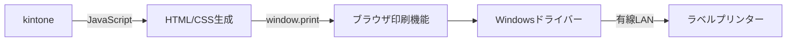

# ラベルプリンター連携 要件定義

## 概要

kintoneからラベルプリンターへの印刷機能を実装する。

## システム構成



## 前提条件

| 項目 | 条件 |
|------|------|
| プリンター接続 | 有線LAN（Wi-Fi非対応） |
| 印刷用PC | プリンターと同一LAN内に配置 |
| ドライバー | オートニクス製Windowsドライバーをインストール |
| ブラウザ | Chrome推奨 |

## 技術仕様

### 採用技術

| 技術 | 用途 |
|------|------|
| kintone JavaScript API | カスタマイズ開発 |
| HTML/CSS | ラベルレイアウト定義 |
| window.print() | ブラウザ印刷機能呼び出し |
| Windowsプリンタードライバー | プリンター制御 |

### データ形式

| 形式 | 使用可否 | 理由 |
|------|----------|------|
| HTML/CSS | **○ 使用** | ベクターデータとして処理され高品質 |
| テキスト | **○ 使用** | フォントがベクターでレンダリング |
| SVG | **○ 使用** | バーコード等のベクター描画に使用 |
| Canvas | **× 不使用** | ラスター化により画質劣化 |
| 画像（PNG/JPG/BMP） | **× 不使用** | ビットマップは画質劣化の原因 |

### 印刷品質

- **ベクターデータのみ使用**することで高品質を担保
- テキスト・図形はドライバーがプリンター解像度に最適化
- 画像データ（ビットマップ）は一切使用しない

## 機能仕様

### 印刷フロー

1. ユーザーがkintone画面で「印刷」ボタンをクリック
2. JavaScriptがレコードデータを取得
3. HTML/CSSでラベルレイアウトを生成
4. ブラウザの印刷ダイアログを表示
5. ユーザーが「印刷」を実行
6. Windowsドライバー経由でプリンターに送信

### ラベルレイアウト

```html
<!-- 印刷用HTML構造 -->
<html>
  <head>
    <style>
      @media print {
        @page {
          size: [ラベル幅] [ラベル高さ];
          margin: 0;
        }
        body {
          margin: 0;
          font-family: 'メイリオ', sans-serif;
        }
      }
    </style>
  </head>
  <body>
    <!-- ラベルコンテンツ -->
  </body>
</html>
```

### バーコード（必要な場合）

```javascript
// JsBarcode（SVG出力）を使用
// ※ Canvas出力は使用しない
JsBarcode("#barcode", "4912345678901", {
  format: "EAN13",
  renderer: "svg"  // 必ずSVGを指定
});
```

## 選定理由

| 観点 | 評価 |
|------|------|
| 印刷品質 | ベクターデータ使用により高品質を維持 |
| 開発コスト | 標準Web技術のみで追加ライブラリ最小 |
| 運用コスト | 追加サーバー不要（To-Be方針と整合） |
| 保守性 | HTML/CSSはWeb開発者が容易にメンテナンス可能 |

## 未定事項

| 項目 | 状態 |
|------|------|
| プリンター機種 | 要確認 |
| ラベルサイズ | 要確認 |
| 印刷項目・レイアウト | 要確認 |
| バーコード有無 | 要確認 |

## 参考

- プリンタードライバー: [オートニクス ダウンロードページ](https://www.autonics.co.jp/)
- ALLコマンド: 本実装では不使用（Windowsドライバー経由のため）
