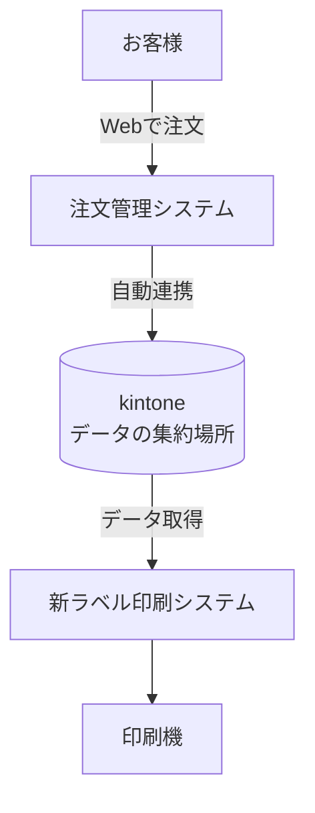

# 給食ラベル印刷システム リニューアルのご提案

---

## 本提案について

**給食ラベル印刷システム**のリニューアルにより、**年間350万円のコスト削減**を実現。**約2年で投資回収**できます。

---

## 結論

| 項目 | 内容 |
|------|------|
| 初期投資 | 700万円（5年償却: 140万円/年） |
| 年間削減効果 | 350万円 |
| **年間メリット** | **210万円/年のプラス** |
| 5年間の効果 | **約1,050万円のプラス** |
| 導入期間 | 約6ヶ月 |

---

## 費用対効果

### 初期投資

| 項目 | 金額 |
|------|------|
| システム開発費 | **700万円** |

### 年間コスト削減効果

| 削減項目 | 年間削減額 | 内訳 |
|----------|------------|------|
| サーバー更新費用 | **160万円** | 800万円 ÷ 5年 |
| 手作業の人件費 | **190万円** | 4時間/日 × 365日 × 時給1,300円 |
| **合計** | **350万円/年** | |

### 5年間の効果

| 年 | 累計削減額 | 初期投資との差額 |
|----|------------|------------------|
| 1年目 | 350万円 | -350万円 |
| 2年目 | 700万円 | ±0万円 |
| 3年目 | 1,050万円 | **+350万円** |
| 4年目 | 1,400万円 | **+700万円** |
| 5年目 | 1,750万円 | **+1,050万円** |

---

## 現状の課題

### 課題1: 注文情報と印刷ソフトが連携されていない

- お客様がWebで注文した情報が、**ラベル印刷ソフトに連携されない**
- そのため従業員が**1件ずつ手入力**している
- 150施設 × 毎日 = **膨大な二重作業**

### 課題2: 古いサーバーの維持コスト

- ラベル印刷用の**専用サーバー**を社内で運用中
- 5年ごとに約800万円の更新費用が発生
- 電気代・保守費用も継続的に発生

### 課題3: 非効率な作業の連続

- 複数のシステムを行き来する作業
- データの手動コピー（CSV出力 → 取込）
- 請求書の印刷・封入・郵送作業

---

## 解決策

### シンプルな仕組みに変更します

```
【現在】                          【リニューアル後】

  FAX                               注文管理システム
   ↓                                     ↓
 手入力（ミスのリスク）              自動でデータ連携
   ↓                                     ↓
 専用サーバー                      クラウド（kintone）
   ↓                                     ↓
ラベル印刷                         新ラベル印刷システム
```

**ポイント:**

- 注文データは**自動で連携**（手入力不要）
- **専用サーバーを廃止**（クラウドに移行）
- 請求書は**メールで自動送信**

---

## 導入後のメリット

### メリット1: ミスの削減

- 手入力がなくなり、**入力ミスがゼロに**
- 誤配送によるクレーム対応が不要に

### メリット2: コスト削減

- 専用サーバーの維持費が**不要**に
- 電気代・保守費用も削減

### メリット3: 業務効率化

- 従業員の**残業時間を削減**
- 浮いた時間を他の業務に活用可能

---

## 導入スケジュール

| フェーズ | 期間 | 内容 |
|----------|------|------|
| 設計 | 1ヶ月目 | 詳細な仕様の決定 |
| 開発 | 2〜4ヶ月目 | システムの構築 |
| テスト | 5ヶ月目 | 動作確認・調整 |
| 導入 | 6ヶ月目 | 本番稼働開始 |

**約6ヶ月で導入完了**

---

## 補足: システム構成図



※ kintone = サイボウズ社が提供するクラウドサービス（データを安全に保管・管理する仕組み）
※ 栄養管理ソフト（EIBUN）は従来通り別途運用

---

ご不明な点がございましたら、お気軽にお問い合わせください。
