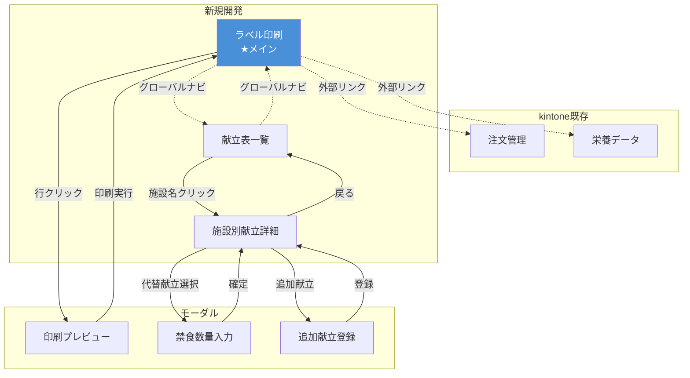

# 画面動線設計

## 画面構成

### kintone既存画面（外部リンク）
- 注文管理画面
- EIBUN連携データ

### 新規開発画面
- **ラベル印刷**（メイン画面）
- 献立表一覧
- 施設別献立詳細

### モーダル
- 印刷プレビュー
- 禁食数量入力
- 追加献立登録

---

## 画面遷移図



---

## 各画面の役割

| 画面 | 役割 | 必要性 |
|------|------|--------|
| **ラベル印刷** | 印刷実行・施設選択 | ◎ 必須 |
| 献立表一覧 | 施設×献立マスタ管理 | ○ 推奨 |
| **施設別献立詳細** | 禁食対応・数量調整 | ◎ 必須 |
| 印刷プレビュー | 印刷前確認 | ○ 推奨 |
| **禁食数量入力** | 禁食対応の数量入力 | ◎ 必須 |
| 追加献立登録 | 特別メニュー登録 | ○ 推奨 |

---

## 業務フロー

### パターン1: 通常印刷（約3分）

```
ラベル印刷画面
  ↓ 食品・施設を選択
  ↓ [選択分を印刷]
完了
```

### パターン2: 禁食対応あり（約10分）

```
献立表一覧
  ↓ 施設名クリック
施設別献立詳細
  ↓ 対象献立選択 → 代替献立選択
禁食数量入力モーダル
  ↓ 数量入力 → 確定
  ↓ [次へ] で次の施設
ラベル印刷画面
  ↓ 印刷実行
完了
```

### パターン3: 注文データ確認（約5分）

```
ラベル印刷画面
  ↓ グローバルナビ [注文管理↗]
kintone注文管理画面（別タブ）
  ↓ データ確認・修正
タブを閉じる
  ↓ データ自動再取得
ラベル印刷画面
```

---

## グローバルナビゲーション

```
┌────────────────────────────────────────────────────┐
│ [ラベル印刷] [献立表一覧] │ [注文管理↗] [栄養データ↗] │
└────────────────────────────────────────────────────┘
```

- `注文管理↗` `栄養データ↗`: 別タブでkintone画面を開く

---

## 改善提案

### 提案: ラベル印刷画面から直接編集

**現状:**
```
ラベル印刷 → 献立表一覧 → 施設別献立詳細
```

**改善案:**
```
ラベル印刷 → 施設別献立詳細（直接）
```

ラベル印刷画面の右ペインに「編集」ボタンを追加。

**メリット:** クリック数減（操作が早い）
**デメリット:** 全体俯瞰画面がなくなる
**判断:** ユーザーテストで検証

---

## 開発優先度

### Phase 1: MVP
1. ラベル印刷
2. 施設別献立詳細
3. 禁食数量入力モーダル

### Phase 2: 運用改善
4. 献立表一覧
5. 印刷プレビューモーダル
6. 追加献立登録モーダル
