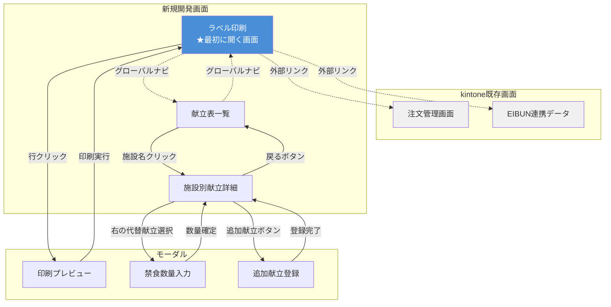

# 画面動線設計

## システム全体の画面構成

### kintone既存画面（外部リンク）
- **注文管理画面**: 注文データの確認・編集（既存）
- **EIBUN連携データ**: 栄養データの確認（既存）

### 新規開発画面
- **ラベル印刷画面**: メイン画面、印刷実行
- **献立表一覧**: 施設×献立のマスタ管理（主菜/副菜設定）
- **施設別献立詳細**: 禁食対応・数量調整

### モーダル
- 印刷プレビュー
- 禁食数量入力
- 追加献立登録

---

## 画面遷移図



---

## 各画面の役割と必要性

### 1. ラベル印刷画面（★メイン画面）

#### 役割
- 食品ごとにラベル印刷を実行
- 印刷対象の選択（食品×施設の組み合わせ）

#### 必要性
**◎ 必須** - システムの最終目的がラベル印刷

#### アクセス
- システム起動時の初期画面
- グローバルナビから常にアクセス可能

#### 遷移先
- `行クリック` → 印刷プレビューモーダル
- `グローバルナビ` → 献立表一覧
- `外部リンク` → kintone注文管理画面
- `外部リンク` → kintone EIBUN連携データ

---

### 2. 献立表一覧

#### 役割
- 施設×献立のマスタ管理
- MAX入数の設定
- 主菜/副菜の設定

#### 必要性
**○ 推奨** - データメンテナンス用

#### アクセス
- グローバルナビから

#### 遷移先
- `施設名クリック` → 施設別献立詳細
- `グローバルナビ` → ラベル印刷画面

#### 簡略化案
この画面を省略して、施設別献立詳細に直接アクセスする方法もあり。
ただし、全体像を俯瞰できる画面として残す方が運用しやすい。

---

### 3. 施設別献立詳細

#### 役割
- 禁食対応（代替献立の設定）
- 数量の微調整
- 追加献立の登録

#### 必要性
**◎ 必須** - 禁食対応は毎日発生する

#### アクセス
- 献立表一覧から施設名クリック
- ラベル印刷画面から直接アクセス（要検討）

#### 遷移先
- `戻るボタン` → 献立表一覧
- `代替献立選択` → 禁食数量入力モーダル
- `追加献立ボタン` → 追加献立登録モーダル

---

## グローバルナビゲーション

全画面共通のヘッダーナビゲーション:

```
┌────────────────────────────────────────────────────────┐
│ 🏠 ラベル印刷システム                                  │
│                                                        │
│ [ラベル印刷] [献立表一覧] │ [注文管理↗] [栄養データ↗] │
└────────────────────────────────────────────────────────┘
```

| ボタン | 遷移先 | 備考 |
|--------|--------|------|
| ラベル印刷 | ラベル印刷画面 | 新規開発 |
| 献立表一覧 | 献立表一覧 | 新規開発 |
| 注文管理↗ | kintone注文管理画面 | 外部リンク（別タブ） |
| 栄養データ↗ | kintone EIBUN連携データ | 外部リンク（別タブ） |

---

## 業務フロー別の動線

### ケース1: 通常の印刷作業（禁食なし）

```
ラベル印刷画面
  ↓
食品を選択（例: ハムステーキ）
  ↓
施設を選択（チェックボックス）
  ↓
[選択分を印刷] ボタン
  ↓
完了
```

**所要時間: 約3分**

---

### ケース2: 禁食対応が必要な場合

```
献立表一覧
  ↓
施設名クリック（例: A介護施設）
  ↓
施設別献立詳細
  ↓
左: 対象献立を選択（例: 焼き魚）
  ↓
右: 代替献立を選択（例: 牛肉ソテー）
  ↓
禁食数量入力モーダル
  ↓
数量入力（例: 2名）→ 確定
  ↓
[次へ] ボタンで次の施設へ
  ↓
全施設完了後、ラベル印刷画面へ
  ↓
印刷実行
```

**所要時間: 約10分（150施設で禁食対応5件の場合）**

---

### ケース3: 注文データの確認・修正

```
ラベル印刷画面
  ↓
グローバルナビ [注文管理↗]
  ↓
kintone注文管理画面（別タブで開く）
  ↓
データ確認・修正
  ↓
タブを閉じて戻る
  ↓
ラベル印刷画面（自動でデータ再取得）
```

**所要時間: 約5分**

---

## 動線の改善提案

### 提案1: 献立表一覧を省略可能にする

**現状:**
```
ラベル印刷 → 献立表一覧 → 施設別献立詳細
```

**改善案:**
```
ラベル印刷 → 施設別献立詳細（直接アクセス）
```

ラベル印刷画面の右ペインに「編集」ボタンを追加し、施設別献立詳細に直接飛べるようにする。

**メリット:**
- クリック数が減る（2クリック → 1クリック）
- 禁食対応時の操作が早くなる

**デメリット:**
- 全体像を俯瞰する画面がなくなる

**判断:** ユーザーテストで検証が必要

---

### 提案2: ラベル印刷画面から注文データを直接編集

**現状:**
- 注文データの確認・修正はkintone画面に飛ぶ必要がある

**改善案:**
- ラベル印刷画面に「数量編集」ボタンを追加
- その場で数量を変更可能にする

**メリット:**
- 画面遷移なしで修正完了
- kintoneへのアクセス回数が減る

**デメリット:**
- kintoneとの二重管理になる（非推奨）
- データ不整合のリスク

**判断:** 実装しない（kintoneが唯一のデータソース）

---

## 画面別 要素配置

### ラベル印刷画面

```
┌────────────────────────────────────────────────────────┐
│ グローバルナビ                                         │
├─────────────────────────────┬──────────────────────────┤
│ 左: 一覧（食品×施設）       │ 右: 詳細パネル          │
│                             │                          │
│ ☑ ハムステーキ (156施設)    │ 施設名: A介護施設        │
│   ☑ A介護施設   287         │ 献立名: ハムステーキ     │
│   ☑ B病院       7           │                          │
│   ☑ C施設       45          │ [編集] ← 追加提案       │
│                             │                          │
│                             │ ラベルプレビュー         │
│                             │                          │
├─────────────────────────────┴──────────────────────────┤
│ ☑ 156件選択中               [選択分を印刷]            │
└────────────────────────────────────────────────────────┘
```

### 献立表一覧

```
┌────────────────────────────────────────────────────────┐
│ グローバルナビ                                         │
├────────────────────────────────────────────────────────┤
│ 施設名 │ 献立名 │ 注文数 │ MAX │ 主/副              │
│ ───────┼────────┼────────┼─────┼──────────────────  │
│ A介護  │ ハム   │  287   │  50 │ [主菜▼] ← クリック │
│ A介護  │ 小松菜 │  287   │  30 │ [副菜▼]            │
│                                                        │
└────────────────────────────────────────────────────────┘
```

### 施設別献立詳細

```
┌────────────────────────────────────────────────────────┐
│ ← 戻る   施設: A介護施設        ✓ 保存しました        │
├─────────────────────────────┬──────────────────────────┤
│ 左: ベース献立              │ 右: 代替献立ライブラリ  │
│                             │                          │
│ 朝食                        │ 🔍 [検索...]            │
│ ☐ 主菜: 焼き魚    28 ← 選択 │                          │
│ 🚫 魚禁食→牛肉    2         │ 💡 おすすめ              │
│                             │ ├ 牛肉ソテー ← 選択     │
│ [+ 禁食追加] [+ 追加献立]   │ └ 豚の生姜焼き          │
│                             │                          │
├─────────────────────────────┴──────────────────────────┤
│                                          [→ 次へ]      │
└────────────────────────────────────────────────────────┘
```

---

## 未確定事項・要検討

### 1. ラベル印刷画面から施設別献立詳細への直接アクセス

**質問:** ラベル印刷画面の右ペインに「編集」ボタンを追加して、施設別献立詳細に直接飛べるようにするか？

**選択肢:**
- A: 追加する（献立表一覧を経由せずに直接編集可能）
- B: 追加しない（献立表一覧を経由する）

**推奨:** A（操作が早くなる）

---

### 2. 献立表一覧の必要性

**質問:** 献立表一覧画面は本当に必要か？

**選択肢:**
- A: 必要（全体俯瞰のため残す）
- B: 不要（ラベル印刷画面から直接編集可能にする）

**推奨:** A（データメンテナンス画面として残す）

---

### 3. 納品書・請求書発行画面

**質問:** 納品書・請求書の発行画面は新規開発が必要か？

**選択肢:**
- A: kintone標準機能で対応（開発不要）
- B: 新規開発画面が必要

**推奨:** 要確認（kintone標準機能で可能なら開発不要）

---

## まとめ

### 最終的な画面構成案

| 画面 | 必要性 | 開発規模 |
|------|--------|----------|
| ラベル印刷 | ◎ 必須 | 大 |
| 献立表一覧 | ○ 推奨 | 小 |
| 施設別献立詳細 | ◎ 必須 | 大 |
| 印刷プレビューモーダル | ○ 推奨 | 中 |
| 禁食数量入力モーダル | ◎ 必須 | 小 |
| 追加献立登録モーダル | ○ 推奨 | 小 |

### 開発優先度

**Phase 1: MVP（最小限）**
1. ラベル印刷画面
2. 施設別献立詳細
3. 禁食数量入力モーダル

**Phase 2: 運用改善**
4. 献立表一覧
5. 印刷プレビューモーダル
6. 追加献立登録モーダル
