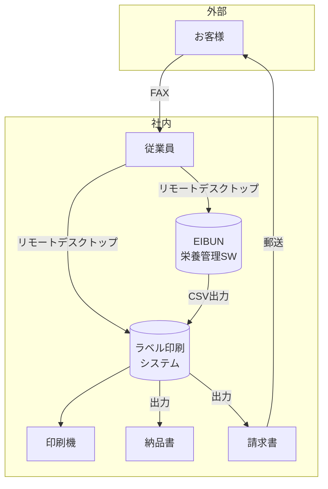

# 現行システム（As-Is）

## システム概要図

## 業務フロー

### 1. 注文受付

1. **お客様**がFAXで注文を送信
2. **従業員**がFAXを確認
3. **従業員**が注文内容をシステムに**手入力**

### 2. 栄養管理

1. **従業員**がリモートデスクトップで**EIBUN（栄養管理ソフト）**にアクセス
2. 献立・栄養データの管理を実施

### 3. ラベル印刷

1. **EIBUN**からCSVファイルを出力
2. **従業員**が別のローカルサーバーにリモートデスクトップでアクセス
3. **ラベル印刷システム**でCSVを取り込み
4. 印刷設定を行う
5. **印刷機**でラベルを印刷

### 4. 納品書・請求書

1. **ラベル印刷システム**のデータから納品書・請求書を出力
2. **印刷機**で印刷
3. 請求書を**郵送**でお客様に送付

## 課題

| 課題                       | 詳細                                                   |
| -------------------------- | ------------------------------------------------------ |
| 手作業が多い               | FAXの内容を手入力するため、入力ミスのリスクがある      |
| システム間連携がない       | EIBUN → ラベル印刷がCSV手動連携                        |
| リモートデスクトップ依存   | 複数のリモートデスクトップ接続が必要                   |
| データの一元管理ができない | 注文データと栄養データが別々に管理されている           |
| 請求書の郵送コスト         | 印刷・封入・郵送の手間とコストがかかる                 |
