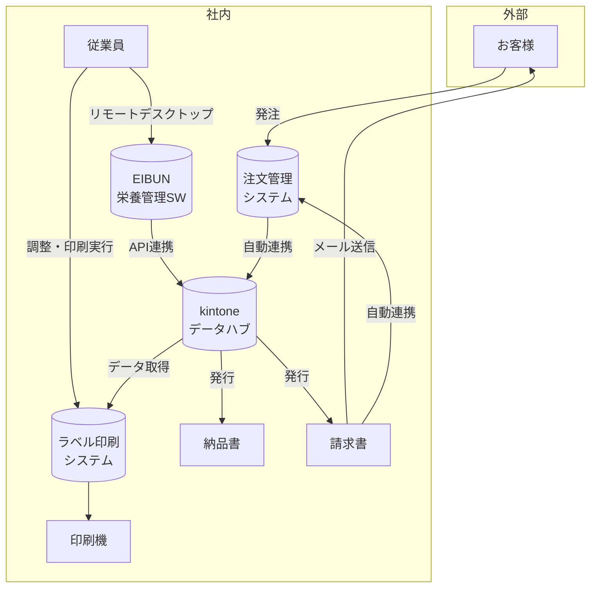

# リニューアル後システム（To-Be）

## システム概要図

## 業務フロー

### 1. 注文受付（自動化）

1. **お客様**が**注文管理システム**から注文
2. 注文データが**kintone**に**自動連携**

### 2. 栄養管理

1. **従業員**が**リモートデスクトップ**で**EIBUN（栄養管理ソフト）**にアクセス
   - ※複数人が同時にアクセスするためリモートデスクトップ接続を継続
2. 献立・栄養データを管理
3. データが**API**で**kintone**に連携

### 3. ラベル印刷（統合）

1. **ラベル印刷システム**がkintoneから双方のデータを取得
   - 注文管理システムからの注文データ
   - EIBUNからの栄養データ
2. 両データを統合してラベルを生成
3. **従業員**がラベル印刷システムで調整を実施
4. **印刷機**でラベルを印刷

### 4. 納品書・請求書発行

1. **kintone**のデータから**納品書**を発行
2. **kintone**のデータから**請求書**を発行
3. 請求書を**お客様にメール送信**
4. 請求書データが**CRMに自動連携**

## 改善ポイント

| 改善点         | Before       | After                       |
| -------------- | ------------ | --------------------------- |
| 注文受付       | FAX → 手入力 | 注文管理システム → 自動連携 |
| システム間連携 | CSV手動連携  | API自動連携                 |
| データ管理     | 分散管理     | kintoneで一元管理           |
| ラベル印刷     | 単独データ   | 注文+栄養データ統合         |

## ユーザーメリット

### 1. 注文数の手入力が不要に

- 注文管理システムから注文データが自動連携されるため、**注文数を手打ちする必要がなくなる**
- 入力ミスのリスク軽減、作業時間の短縮

### 2. 物理サーバー廃止によるコスト削減

- 現行のラベル印刷システム用リモートデスクトップ（物理サーバー）を**廃止可能**
- サーバー維持費・電気代・保守コストの**大幅削減**

### 3. 納品書・請求書発行の効率化

- kintoneのデータから**納品書・請求書を直接発行**
- 請求書は**メールで自動送信**、**CRMに自動連携**
- 手作業での書類作成・送付作業が不要に

## 費用対効果

### 年間コスト削減効果

| 項目             | 計算                       |     年間コスト |
| ---------------- | -------------------------- | -------------: |
| 物理サーバー保守 | 800万円 ÷ 5年              |    **160万円** |
| 手作業工数削減   | 8時間/日 × 365日 × 1,500円 |    **438万円** |
| **合計**         |                            | **598万円/年** |

### 削減内訳

- **物理サーバー**: ラベル印刷システム用リモートデスクトップサーバーの廃止
- **手作業工数**: FAX手入力 + 印刷システム連携入力の自動化（150社 × 365日稼働）

## システム構成

| システム           | 役割                              | 連携方式              |
| ------------------ | --------------------------------- | --------------------- |
| 注文管理システム   | お客様からの注文受付              | kintone自動連携       |
| EIBUN              | 栄養管理・献立管理                | kintone API連携       |
| kintone            | データハブ（注文+栄養データ統合） | 各システムとAPI連携   |
| ラベル印刷システム | 統合データからラベル生成・印刷    | kintoneからデータ取得 |
